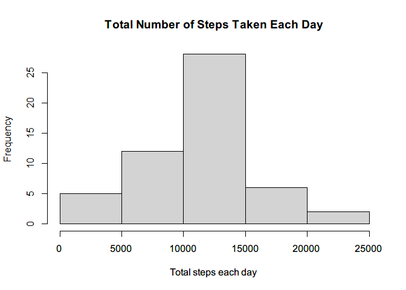
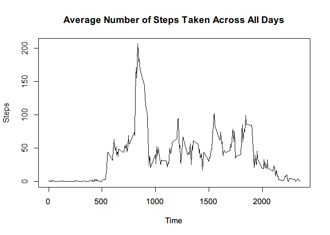
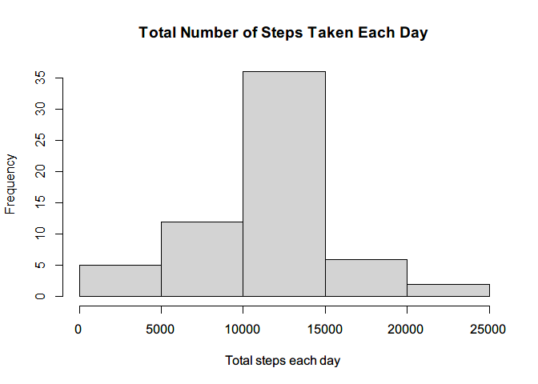
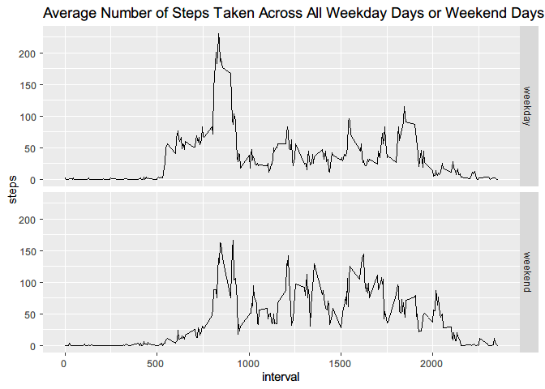

## Loading and preprocessing the data

Load the data.


```r
if(!file.exists("activity.csv")){
        unzip("activity.zip")
}
Activity <- read.csv("activity.csv")
```

Process the data into a format suitable for your analysis.


```r
Activity$date <- as.Date(Activity$date, "%Y-%m-%d")
```

## What is mean total number of steps taken per day?

Make a histogram of the total number of steps taken each day.


```r
Total_steps <- aggregate(steps ~ date, Activity, sum, na.rm = T)
hist(Total_steps$steps,
     main = "Total Number of Steps Taken Each Day",
     xlab = "Total steps each day")
```

<!-- -->

Calculate and report the mean and median total number of steps taken per day.


```r
mean(Total_steps$steps)
```

```
## [1] 10766.19
```

```r
median(Total_steps$steps)
```

```
## [1] 10765
```

## What is the average daily activity pattern?

Make a time series plot of the 5-minute interval (x-axis) and the average number of steps taken, averaged across all days (y-axis).


```r
Average_steps <- aggregate(steps ~ interval, Activity, mean, na.rm = T)
plot(Average_steps,
     type = "l",
     main = "Average Number of Steps Taken Across All Days",
     xlab = "Time",
     ylab = "Steps"
)
```

<!-- -->

Which 5-minute interval, on average across all the days in the dataset, contains the maximum number of steps?


```r
Average_steps$interval[which.max(Average_steps$steps)]
```

```
## [1] 835
```

## Imputing missing values

Calculate and report the total number of missing values in the dataset.


```r
NA_steps <- is.na(Activity$steps)
sum(NA_steps)
```

```
## [1] 2304
```

Devise a strategy for filling in all of the missing values in the dataset and create a new dataset that is equal to the original dataset but with the missing data filled in.


```r
New_activity <- Activity
for(i in 1:sum(NA_steps)){
       New_activity[NA_steps,][i, 1] <- Average_steps[New_activity[NA_steps,][i, 3] == Average_steps$interval, 2]
} 
```

Make a histogram of the total number of steps taken each day and Calculate and report the mean and median total number of steps taken per day.


```r
New_total_steps <- aggregate(steps ~ date, New_activity, sum, na.rm = T)
hist(New_total_steps$steps,
     main = "Total Number of Steps Taken Each Day",
     xlab = "Total steps each day")
```

<!-- -->

```r
mean(New_total_steps$steps)
```

```
## [1] 10766.19
```

```r
median(New_total_steps$steps)
```

```
## [1] 10766.19
```

The means are identical while the medians are different.

## Are there differences in activity patterns between weekdays and weekends?

Create a new factor variable in the dataset with two levels -- "weekday" and "weekend" indicating whether a given date is a weekday or weekend day.


```r
Week <- weekdays(New_activity$date)
for(i in 1:length(Week)){
        Week[i] <- ifelse(Week[i] %in% c("星期六", "星期日"), "weekend", "weekday")
}
New_activity$week <- factor(Week)
```

Make a panel plot containing a time series plot of the 5-minute interval and the average number of steps taken, averaged across all weekday days or weekend days.


```r
library(ggplot2)
New_average <- aggregate(steps ~ interval + week, New_activity, mean, na.rm = T)
qplot(x = interval,
      y = steps,
      geom = "line",
      data = New_average,
      main = "Average Number of Steps Taken Across All Weekday Days or Weekend Days",
      facets = week ~ .)
```

<!-- -->
